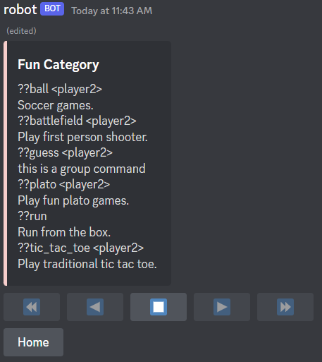

# starlight-dpy
A utility library that she uses for discord.py

This 'library' is still in pre-alpha. Major changes will be made
and the final version is unclear.

Do not use this in a production code.

### Installation
```
pip install git+https://github.com/InterStella0/starlight-dpy
```

## Menu Help Command
Easily paginate your help command with little effort.
```python
import starlight
import discord

from discord.ext import commands

bot = commands.Bot(
    command_prefix="??",
    help_command=starlight.MenuHelpCommand(
        per_page=10,
        accent_color=0xffcccb,
        error_color=discord.Color.red()
    ),
    intents=discord.Intents.all(),
    description="Demonstration bot"
)
```
**Output**




### Customizing
You can easily customize your help command by overriding `format_*` methods!

Format methods: 
- `format_command_brief(cmd: commands.Command)`
- `format_cog_page(view: HelpMenuCog, data: List[commands.Command])`
- `format_group_detail(view: HelpMenuGroup)`
- `format_command_detail(view: HelpMenuCommand)`
- `format_error_detail(view: HelpMenuError)`
- `format_front_bot_menu(mapping: Dict[Optional[commands.Cog], List[commands.Command]])`

**Example:**
```python
class MyMenuHelpCommand(starlight.MenuHelpCommand):
    async def format_front_bot_menu(self, mapping):
        return discord.Embed(
            title="Help",
            description="Choose a category to display your help command!",
            color=self.accent_color
        )


bot = commands.Bot(
    command_prefix="??",
    help_command=MyMenuHelpCommand(
            per_page=10,
            accent_color=0xffcccb,
            error_color=discord.Color.red(),
            pagination_emojis={
                "start_button": discord.ui.Button(emoji="⏪"),
                "previous_button": discord.ui.Button(emoji="◀️", style=discord.ButtonStyle.blurple),
                "stop_button": discord.ui.Button(emoji="⏹️", style=discord.ButtonStyle.red),
                "next_button": discord.ui.Button(emoji="▶️", style=discord.ButtonStyle.blurple),
                "end_button": discord.ui.Button(emoji="⏩")
            }
    ),
    intents=discord.Intents.all(),
    description="Demonstration bot"
)
```
**Output**


